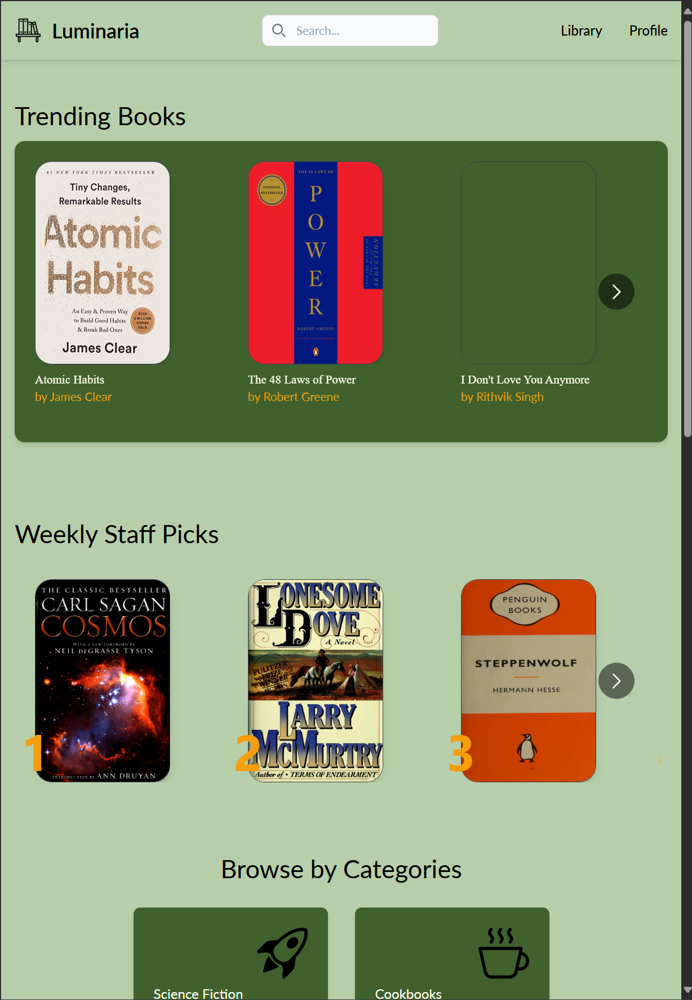
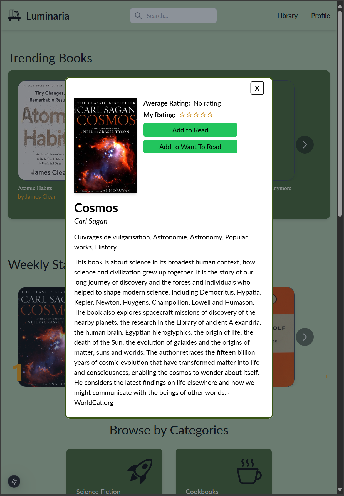
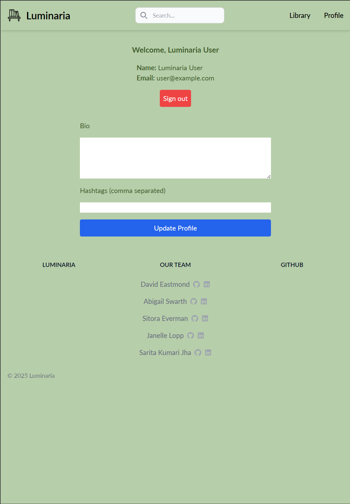

## About the project

Luminaria is a library application that helps users rate books, keep track of titles they've read and want to read. It uses the openlibrary API to fetch trending books. We also have a staff picks session.

### Live Deploy

https://luminaria-library.vercel.app/

### Screenshots

## Features

### Authentication

- Users can sign in and out of the app using Google or Github OAuth.

### Book Management

- Users can view book titles and cover images.
- Users can view book title details.
- Users can add a book title to their want-to-read and read lists
- Users can give a star rating to books and can view an average rating among all Luminaria users for a given title

### Search

- Users can search for book titles.

### Profile and Bio

- Users can view and update their bio and their interest hashtags.

### Future Features

- Book recommendations

## Tech Stack

- <b>MongoDb</b> is our database stack, using <b>mongoose</b> as our ORM.
- <b>NextJS</b> with <b>Typescript</b> we are using as our full-stack React frame-work
- <b>Vercel</b> is the hosting provider.
- <b>TailwindCSS</b> for styling.
- <b>NextAuth</b> is used for authentication. We're using Github and Google OAuth providers.
- <b>[Open Library](https://openlibrary.org/)</b> API is our source for book author, title and book image cover data

## Development environment

1. Clone the repo
2. Run `npm i` to install dependencies.
3. Run `npm run dev` to launch the local development instance.

### Environment variables

1. MongoDb: Create a MongoDb Atlas account (in the cloud) (https://account.mongodb.com/account/login) and copy the connection string. You can also create a local instance of mongodb. Add the connection string to this environment variable `MONGODB_URI`. See (https://www.mongodb.com/docs/manual/reference/connection-string/).

2. Authentication: In your Google Cloud Console, setup Google Auth. Follow these instructions [Google Cloud Console](https://developers.google.com/identity/protocols/oauth2) and [NextAuth](https://authjs.dev/getting-started/providers/google). Remember to create the appopriate environment variables.

3. Follow a similar process to setup [Github w/ NextAuth](https://authjs.dev/getting-started/providers/github?framework=next-js). Remember to create the appopriate environment variables.

4. Create a `AUTH_SECRET` environment variable and populate it with a string of your choosing. it's used with NextAuth to generate a secret.  

## Our Team

- David Eastmond: [GitHub](https://github.com/davideastmond) / [LinkedIn](https://linkedin.com/in/david-eastmond-2783ab18a)
- Abigail Swarth: [GitHub](https://github.com/abby-wankenobi) / [LinkedIn](www.linkedin.com/in/abigailswarth)
- Sitora Everman [GitHub](https://github.com/sittora) / [LinkedIn](https://www.linkedin.com/in/sitora-everman/)
- Janelle Lopp [GitHub](https://github.com/Jnicolle98) / [LinkedIn](https://www.linkedin.com/in/janelle-lopp/)
- Sarita Kumari Jha [GitHub](https://github.com/Sarita1517) / [LinkedIn](https://www.linkedin.com/in/sjhabsc/)
